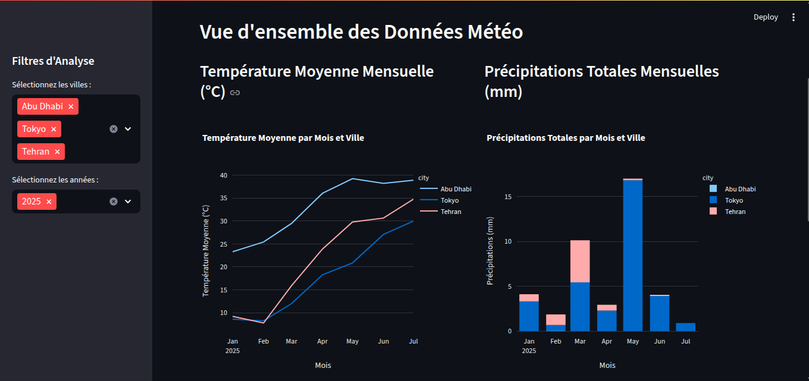
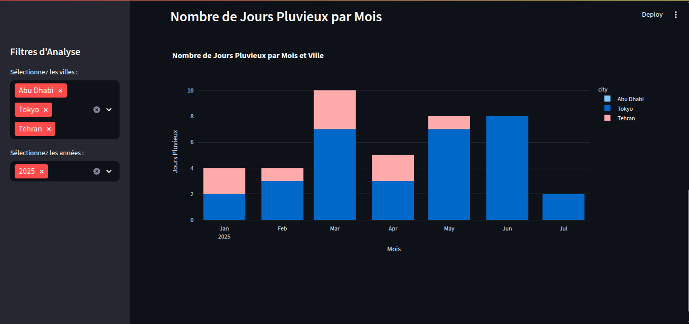
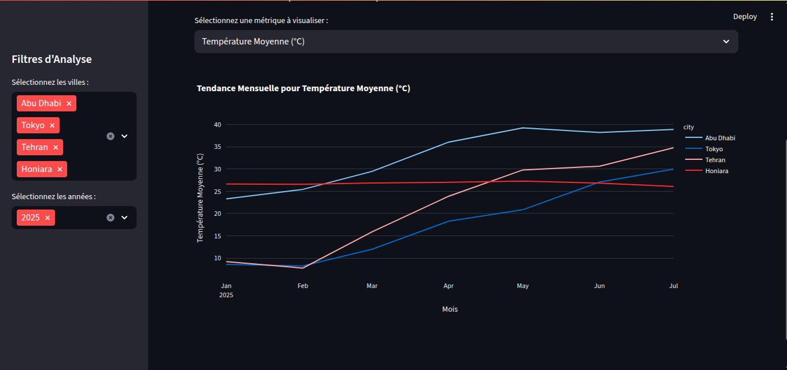
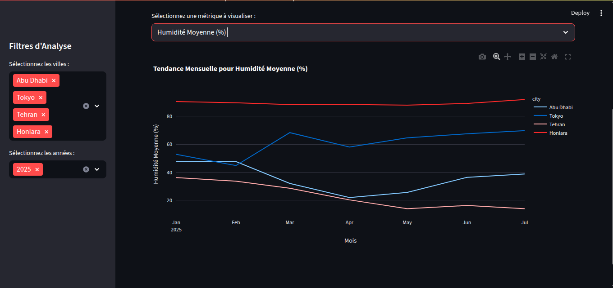
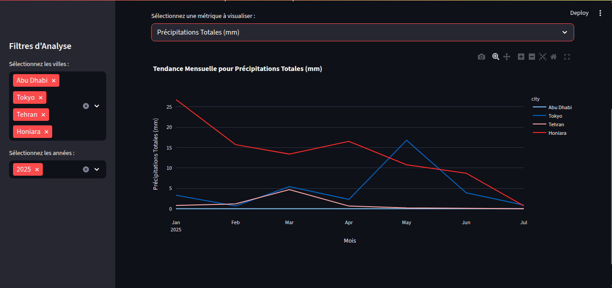

# Projet de Tableau de Bord Météo

Ce projet met en œuvre un pipeline ETL (Extraction, Transformation, Chargement) pour collecter, nettoyer, transformer et modéliser des données météorologiques provenant de différentes sources. Les données traitées sont ensuite visualisées à travers un tableau de bord interactif construit avec Streamlit.

## Structure du Projet

```
weather\_dashboard\_project/
├── .env                  \# Fichier pour les variables d'environnement (clés API)
├── .gitignore            \# Fichier pour ignorer les fichiers non pertinents pour Git
├── dashboard\_app.py      \# Application Streamlit pour le tableau de bord
├── etl\_scripts/          \# Scripts Python pour le pipeline ETL
│   ├── extract\_data.py   \# Script pour l'extraction des données brutes
│   ├── transform\_data.py \# Script pour la transformation et l'unification des données
│   └── data\_modeling.py  \# Script pour la modélisation et l'agrégation des données
└── data/                 \# Répertoire pour les données
├── raw/              \# Données brutes (JSON initial, CSV historique, données OpenWeather extraites)
│   ├── all\_capitals\_weather.json
│   └── historical\_test.csv
└── processed/        \# Données traitées et modélisées (fichiers Parquet)
├── transformed\_weather\_data.parquet
└── modeled\_weather\_data.parquet

```

## Description des Scripts

### 1. Scripts ETL (`etl_scripts/`)

Les scripts ETL sont conçus pour être exécutés séquentiellement afin de préparer les données. Ils utilisent la variable d'environnement `AIRFLOW_HOME` pour localiser les chemins des fichiers. Assurez-vous que cette variable est définie (par exemple, dans votre fichier `.env` ou directement dans votre session shell).

#### `extract_data.py`
Ce script est responsable de l'extraction des données météorologiques de diverses sources :
-   Un fichier JSON local (`all_capitals_weather.json`) contenant des données initiales.
-   L'API OpenWeather pour les données météorologiques actuelles. Une clé API OpenWeather valide est requise et doit être définie dans la variable d'environnement `OPENWEATHER_API_KEY`.
-   Un fichier CSV local (`historical_test.csv`) pour les données historiques (ceci est un fichier de test qui doit être remplacé par vos données historiques réelles si vous en avez).

*Pour exécuter :*

```bash
python3 etl_scripts/extract_data.py
````

#### `transform_data.py`

Ce script prend les données brutes extraites, les nettoie, les standardise et les unifie en un seul DataFrame. Il gère les types de données, les valeurs manquantes et harmonise les schémas de différentes sources. Le DataFrame unifié est ensuite sauvegardé au format Parquet dans `data/processed/transformed_weather_data.parquet`.

*Pour exécuter :*

```bash
python3 etl_scripts/transform_data.py
```

#### `data_modeling.py`

Après la transformation, ce script charge le DataFrame unifié et effectue des agrégations supplémentaires pour créer un "data mart" optimisé pour la visualisation. Pour ce projet, il calcule des résumés mensuels tels que la température moyenne, les précipitations totales et le nombre de jours de pluie par ville. Les données modélisées sont sauvegardées au format Parquet dans `data/processed/modeled_weather_data.parquet`.

*Pour exécuter :*

```bash
python3 etl_scripts/data_modeling.py
```

### 2\. Tableau de Bord (`dashboard_app.py`)

Le tableau de bord interactif est construit avec Streamlit. Il lit les données modélisées (`data/processed/modeled_weather_data.parquet`) et fournit une interface conviviale pour explorer les tendances météorologiques. Les utilisateurs peuvent filtrer les données par ville et par année et visualiser différentes métriques via des graphiques.

*Pour exécuter :*
Assurez-vous que vous êtes dans le répertoire racine du projet (`weather_dashboard_project/`) avant d'exécuter cette commande.

```bash
streamlit run dashboard_app.py
```

Après l'exécution, une fenêtre de navigateur s'ouvrira automatiquement pour afficher le tableau de bord.

-----

## Prérequis

  - **Python 3.8+**
  - **pip** (gestionnaire de paquets Python)
  - **Environnement Virtuel** (fortement recommandé)
  - **Clé API OpenWeather** (si vous souhaitez extraire des données réelles via l'API)

## Configuration de l'Environnement

1.  **Créer et activer un environnement virtuel** (si ce n'est pas déjà fait) :

    ```bash
    python3 -m venv venv
    source venv/bin/activate
    ```

2.  **Installer les dépendances** :

    ```bash
    pip install pandas numpy streamlit plotly
    ```

## Étapes d'Utilisation

1.  **Exécuter le pipeline ETL dans l'ordre :**
    Assurez-vous que vos variables d'environnement `AIRFLOW_HOME` et `OPENWEATHER_API_KEY` sont définies.

    ```bash
    python3 etl_scripts/extract_data.py
    python3 etl_scripts/transform_data.py
    python3 etl_scripts/data_modeling.py
    ```

    Cela va extraire, transformer et modéliser les données, en générant les fichiers `.parquet` nécessaires dans le dossier `data/processed/`.

2.  **Lancer le tableau de bord Streamlit :**
    Assurez-vous d'être à la racine de votre projet (`weather_dashboard_project/`).

    ```bash
    streamlit run dashboard_app.py
    ```

    Votre navigateur ouvrira le tableau de bord interactif.









