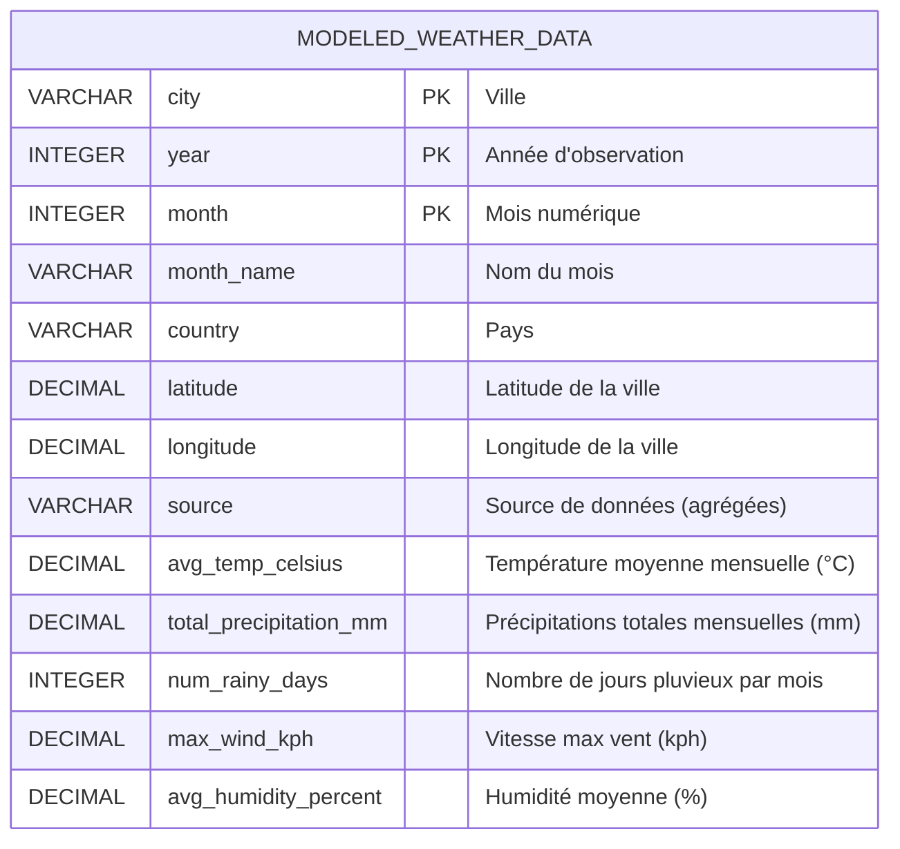
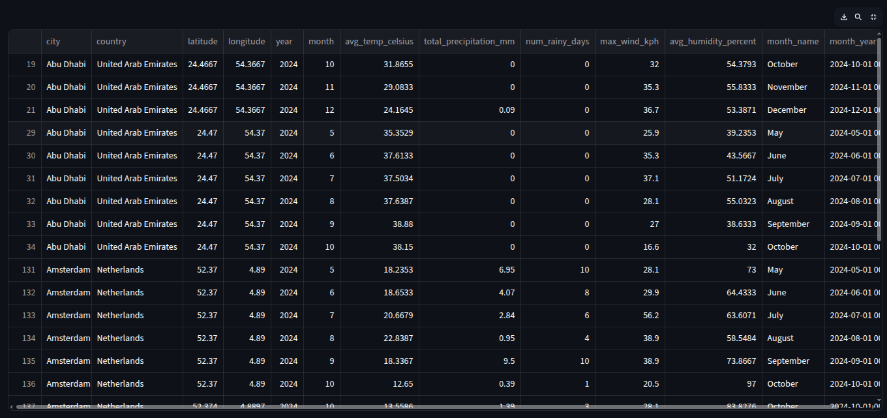
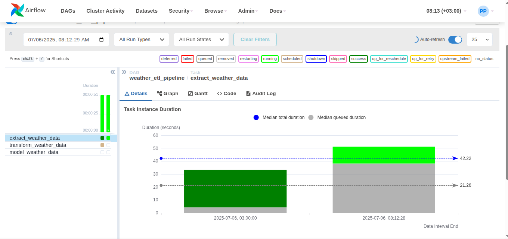

# Projet de Tableau de Bord Météo

Ce projet met en œuvre un pipeline ETL (Extraction, Transformation, Chargement) complet pour collecter, nettoyer, transformer et modéliser des données météorologiques provenant de différentes sources. Les données traitées sont ensuite visualisées à travers un tableau de bord interactif construit avec Streamlit. **L'ensemble du pipeline ETL est automatisé et orchestré par Apache Airflow.**

## Description des Composants

### 1. Scripts ETL (`etl_scripts/`)

Les scripts ETL sont les cœurs du pipeline de traitement des données. Ils sont conçus pour être exécutés séquentiellement pour préparer les données.

#### `extract_data.py`
Ce script est responsable de l'extraction des données météorologiques de diverses sources : un fichier JSON local (`all_capitals_weather.json`), l'API OpenWeather (nécessite une `OPENWEATHER_API_KEY`) et un fichier CSV local (`historical_test.csv`).

*Pour exécution manuelle :*
```bash
python3 etl_scripts/extract_data.py
````

#### `transform_data.py`

Ce script prend les données brutes extraites, les nettoie, les standardise et les unifie en un seul DataFrame. Il gère les types de données, les valeurs manquantes et harmonise les schémas des différentes sources. Le DataFrame unifié est ensuite sauvegardé au format Parquet dans `data/processed/transformed_weather_data.parquet`.

*Pour exécution manuelle :*

```bash
python3 etl_scripts/transform_data.py
```

#### `data_modeling.py`

Après la transformation, ce script charge le DataFrame unifié et effectue des agrégations supplémentaires pour créer un "data mart" optimisé pour la visualisation. Il calcule des résumés mensuels tels que la température moyenne, les précipitations totales et le nombre de jours de pluie par ville. Les données modélisées sont sauvegardées au format Parquet dans `data/processed/modeled_weather_data.parquet`.

*Pour exécution manuelle :*

```bash
python3 etl_scripts/data_modeling.py
```

### 2\. Tableau de Bord Streamlit (`dashboard_app.py`)

Le tableau de bord interactif est construit avec Streamlit. Il lit les données modélisées (`data/processed/modeled_weather_data.parquet`) et fournit une interface conviviale pour explorer les tendances météorologiques. Les utilisateurs peuvent filtrer les données par ville et par année et visualiser différentes métriques via des graphiques.

*Pour exécuter :*
Assurez-vous d'être dans le répertoire racine du projet.

```bash
streamlit run dashboard_app.py
```

### 3\. Jupyter Notebook (`notebooks/data_exploration.ipynb`)

Ce notebook est destiné à l'exploration de données (EDA) et à l'analyse ad-hoc des données modélisées. Il permet de prototyper des visualisations et d'approfondir la compréhension des ensembles de données.

*Pour exécuter :*
Assurez-vous d'être dans le répertoire racine du projet.

```bash
jupyter notebook
```

Puis, ouvrez `notebooks/data_exploration.ipynb` dans l'interface web de Jupyter.

### 4\. DAG Airflow (`dags/weather_etl_dag.py`)

Ce fichier définit un Directed Acyclic Graph (DAG) pour Apache Airflow. Il **automatise et orchestre l'exécution séquentielle** des scripts ETL (`extract_data.py`, `transform_data.py`, `data_modeling.py`). Le DAG est configuré pour s'exécuter quotidiennement, garantissant que les données du tableau de bord sont régulièrement mises à jour.

## Prérequis

  - **Python 3.8+**
  - **pip** (gestionnaire de paquets Python)
  - **Environnement Virtuel** (fortement recommandé)
  - **Clé API OpenWeather** (nécessaire pour l'extraction via l'API)
  - **Apache Airflow** (pour l'orchestration automatique du pipeline)

## Configuration de l'Environnement

1.  **Créer et activer un environnement virtuel** :

    ```bash
    python3 -m venv venv
    source venv/bin/activate
    ```

2.  **Installer les dépendances** :

    ```bash
    pip install pandas numpy streamlit plotly notebook matplotlib seaborn apache-airflow
    ```

3.  **Définir les variables d'environnement :**
    Les scripts et le DAG Airflow utilisent `AIRFLOW_HOME` pour localiser les données et `OPENWEATHER_API_KEY` pour l'API. **Ces variables doivent être définies dans votre session terminal avant d'exécuter les scripts, et également configurées dans l'environnement de votre installation Airflow pour l'orchestration.**

    ```bash
    export AIRFLOW_HOME="/home/project_dir" # Remplacez par le chemin absolu de votre dossier racine du projet
    export OPENWEATHER_API_KEY="votre_cle_api" # Remplacez par votre clé OpenWeather API réelle
    ```

## Utilisation du Projet

### 1\. Exécution Manuelle du Pipeline ETL

Pour une exécution ponctuelle ou des tests :

```bash
python3 etl_scripts/extract_data.py
python3 etl_scripts/transform_data.py
python3 etl_scripts/data_modeling.py
```

### 2\. Lancement du Tableau de Bord Streamlit

```bash
streamlit run dashboard_app.py
```

### 3\. Exploration des Données avec Jupyter Notebook

```bash
jupyter notebook
```

### 4\. Automatisation avec Apache Airflow

Le DAG `weather_etl_dag.py` gère l'automatisation du pipeline.

  * **Intégration :** Placez `dags/weather_etl_dag.py` dans le dossier `dags/` de votre installation Airflow.
  * **Exécution :** Une fois qu'Airflow détecte le DAG, vous pouvez l'activer et observer ses exécutions planifiées ou le déclencher manuellement via l'interface utilisateur d'Airflow. Les tâches `extract_weather_data`, `transform_weather_data`, et `model_weather_data` s'exécuteront séquentiellement.

-----


### 5\. Modèle de Données

Le modèle de données final, stocké dans `modeled_weather_data.parquet`, suit une approche de **schéma en étoile dénormalisé**.

Dans ce modèle, le fichier `modeled_weather_data.parquet` agit comme une **table de faits** centrale. Pour simplifier et optimiser les jointures pour l'application de tableau de bord, les attributs dimensionnels sont directement intégrés (dénormalisés) dans cette table de faits, plutôt que d'être stockés dans des tables de dimensions séparées.

  * **Table de Faits : `modeled_weather_data.parquet`**
      * **Dimensions dénormalisées :**
          * `city` (Ville)
          * `country` (Pays)
          * `latitude`, `longitude` (Coordonnées géographiques)
          * `year` (Année)
          * `month` (Mois numérique)
          * `month_name` (Nom du mois)
          * `source` (Source de données agrégées)
      * **Mesures (Agrégats) :**
          * `avg_temp_celsius` (Température moyenne mensuelle en °C)
          * `total_precipitation_mm` (Précipitations totales mensuelles en mm)
          * `num_rainy_days` (Nombre de jours pluvieux par mois)
          * `max_wind_kph` (Vitesse maximale du vent en kph)
          * `avg_humidity_percent` (Humidité moyenne en %)

### Diagramme du Modèle de Données



*Explication du diagramme :* Ce diagramme Entité-Relation simplifiée représente la structure de la table `MODELED_WEATHER_DATA`. Les colonnes `city`, `year`, et `month` agissent comme des clés primaires composites, car chaque ligne représente un agrégat unique pour une ville donnée, pour un mois et une année spécifiques. Les autres colonnes sont soit des attributs dimensionnels dénormalisés (comme `country`, `month_name`), soit les mesures agrégées calculées.

## Aperçus du Tableau de Bord et du Pipeline Airflow

### Tableau de Bord Streamlit

Le tableau de bord permet une exploration interactive des données météorologiques modélisées. Les filtres sur la gauche permettent de sélectionner les villes et les années d'intérêt.

  * **Vue d'ensemble des Données Météo :**
    Ceci est l'écran principal du tableau de bord, affichant une vue synthétique. À gauche, les "Filtres d'Analyse" permettent de sélectionner les villes (ici 'Abu Dhabi', 'Tokyo', 'Tehran') et les années (ici '2025'). À droite, deux graphiques sont présentés côte à côte :

      * **Température Moyenne Mensuelle (°C) :** Un graphique linéaire montrant l'évolution de la température moyenne par mois pour les villes sélectionnées. On peut observer les tendances climatiques spécifiques à chaque ville sur l'année choisie.

      

      * **Précipitations Totales Mensuelles (mm) :** Un graphique à barres empilées représentant les précipitations cumulées par mois pour chaque ville sélectionnée. Cela aide à identifier les mois les plus pluvieux et à comparer les régimes de précipitations entre les villes.
      
      

  * **Nombre de Jours Pluvieux par Mois :**
    Ce graphique à barres empilées détaille le nombre de jours où des précipitations ont été enregistrées pour chaque ville sélectionnée, mois par mois. Il est utile pour comprendre la fréquence des jours de pluie plutôt que la quantité totale de pluie. Les filtres sont cohérents avec les autres vues.

    

  * **Tendance Mensuelle pour Température Moyenne (°C) :**
    Un graphique linéaire dédié à l'évolution de la température moyenne mensuelle. Il permet de visualiser précisément la courbe de température pour les villes sélectionnées sur l'année 2025, aidant à identifier les saisons chaudes et froides.

    

  * **Tendance Mensuelle pour Humidité Moyenne (%) :**
    Un autre graphique linéaire montrant la tendance de l'humidité moyenne par mois pour les villes choisies. Ceci est important pour évaluer le confort climatique ou les conditions agricoles.

    

  * **Tendance Mensuelle pour Précipitations Totales (mm) :**
    Ce graphique linéaire se concentre sur les précipitations totales mensuelles. Il complète le graphique à barres de la vue d'ensemble en montrant l'évolution continue des précipitations mois par mois.

    

  * **Données Modélisées Brutes**
    
    
### Tableau de Bord Airflow

L'interface utilisateur d'Airflow offre une vue d'ensemble des DAGs et de l'état de leurs tâches.

  * **Vue d'ensemble du DAG ETL Météo :**
    Cette capture d'écran de l'interface utilisateur d'Apache Airflow montre le statut des tâches pour le DAG `weather_etl_pipeline`. On peut y voir la durée d'exécution de chaque tâche (`extract_weather_data`, `transform_weather_data`, `model_weather_data`), leur statut (succès, échec, en cours), et un aperçu visuel de la durée et de l'enchaînement des tâches. Cela confirme que les scripts ETL sont bien orchestrés et exécutés par Airflow.

    
    
<!-- end list -->

